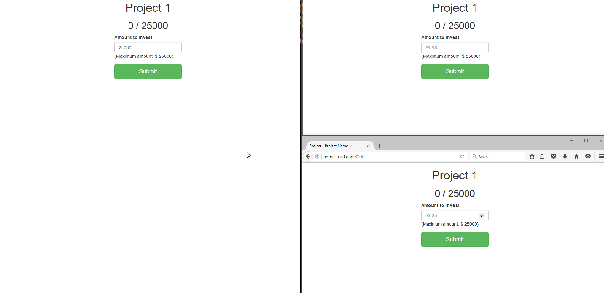
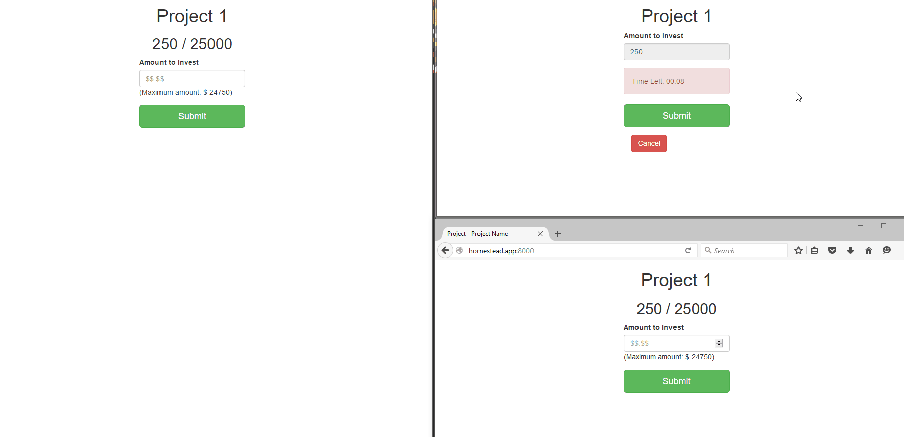

# Transactional Sockets
This is a Proof of Concept for a payment system to reserve an amount of money while a user fills out their payment information.

# Features
Once an amount is Submitted a temporary transaction is created with an "expires_at" timestamp which is 5 minutes from the current time. The project's amount_reserved column stores this information following the "store what you query for" mentality. The amount_raised column is the true amount of completed transactions that the project owner would see. 

Using [Socket.io](https://socket.io) and [Redis](http://redis.io/) we are able to provide real time, no page refresh, functionality. The end user will instantly see if the amount they are trying to input is no longer available. 

Using [Laravel's Task Scheduler](https://laravel.com/docs/master/scheduling) a command is executed which finds transactions that have passed the "expires_at" timestamp and removes them automatically. This way if the user does not complete the form the amount is automatically added back to the amount available for that project. The smallest increment a schedule can run is every minute, so this code executes once a minute. I figure if a user gets a little extra time than is shown to them it isn't the end of the world. This code is in app\Console\Commands\ClearExpiredTransactions.php

